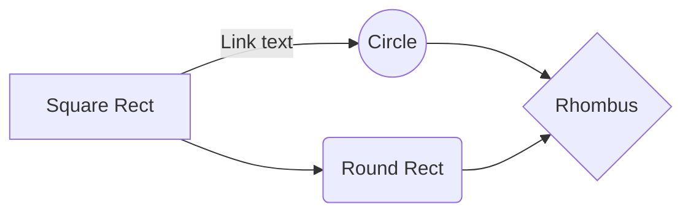

# ProjCCM3B
Repositório da turma do curso técnico do Colégio Cecilia Meirelles

## Proprietário
**Marcelo Aparecido Micalowski**

<h1 align="center">
    <a href="https://pt-br.reactjs.org/">🔗 React</a>
</h1>

🚀 lib para construir interfaces do usuário com componentes reutilizáveis

Tabela de conteúdos
=================
<!--ts-->
   * [Sobre](#Sobre)
   * [Tabela de Conteudo](#tabela-de-conteudo)
   * [Instalação](#instalacao)
   * [Como usar](#como-usar)
      * [Pre Requisitos](#pre-requisitos)
      * [Local files](#local-files)
      * [Remote files](#remote-files)
      * [Multiple files](#multiple-files)
      * [Combo](#combo)
   * [Tests](#testes)
   * [Tecnologias](#tecnologias)
<!--te-->

### Features

- [x] Cadastro de usuário
- [x] Cadastro de cliente
- [ ] Cadastro de produtos
- [x] Geração de Relatórios

